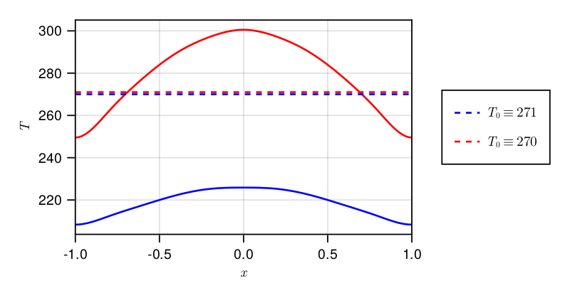
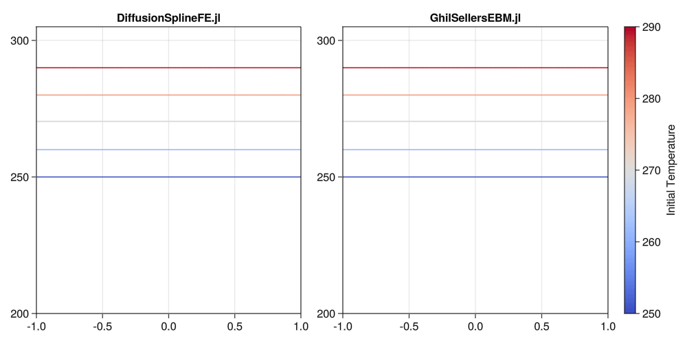

```@meta
CurrentModule = DiffusionSplineFE
```

# Ghil-Sellers Energy Balance Model

The entire code for this example can be found as a [jupyter-notebook](https://github.com/joristh/DiffusionSplineFE.jl/blob/main/example/GhilSellersEBM.ipynb).

## Model

The one-dimensional Ghil-Sellers energy balance model ([Sellers1969](https://doi.org/10.1175/1520-0450(1969)008<0392:agcmbo>2.0.co;2), [Ghil1976](https://doi.org/10.1175/1520-0469(1976)033<0003:csfast>2.0.co;2), [Bdai2014](https://doi.org/10.1007/s00382-014-2206-5)) is given by the diffusion equation

$$\begin{align*}
    c(x)T_t = \left( \frac{2}{\pi}\right)^2 \frac{1}{\cos(\pi x/2)} \left[\cos(\pi x/2) k(x,T)T_x)\right]_x + \mu Q(x) \left[1 - \alpha(x, T)\right] - \sigma T^4 \left[1 - m \tanh(c_3T^6)\right]
\end{align*}$$

where $x = 2\phi/\pi \in [-1, 1]$ with homogeneous Neumann boundary conditions and a prescribed initial condition. The diffusive term $k(x,T)$ is governed by eddy diffusivities for sensible and latent heat

$$\begin{align*}
	k(x, T) &= k_1(x) + k_2(x)g(T)\\
	g(T) &= c_4/T^2 \exp(-c_5/T).
\end{align*}$$

The temperature- and latitude-dependent albedo is given by

$$\begin{align*}
	\alpha(x, T) = \left\{ b(x) - c_1 [T_m + min(T-c_2 z(x) - T_m, 0)] \right\}_c
\end{align*}$$

with the cutoff function

$$\begin{align*}
	h_c = 
	\begin{cases}
		h_{min}, & h \leq h_{min}\\
		h, & h_{min} < h < h_{max}\\
		h_{max}, & h_{max} \leq h
	\end{cases}
\end{align*}$$

All parameters (constants and functions) are empirically found and interpolated values from the original paper by Sellers are used.

Multiplying with $\cos(\pi x/2)$, the energy balance model can be rewritten in general form which yields

$$\begin{align*}
	C(x) &= \cos(\pi x/2) c(x)\\
	D(x, T) &= \left(\frac{2}{\pi}\right)^2 \cos(\pi x/2) k(x, T)\\
	S(x, T) &= \cos(\pi x/2) \left( \mu Q(x) \left[1 - \alpha(x, T)\right] - \sigma T^4 \left[1 - m \tanh(c_3T^6)\right] \right)
\end{align*}$$

and solved with DiffusionSplineFE.jl.

## Results

The figure shows equilibrium states for two close initial conditions. The ODEs are integrated until $t_{end} = 3 \cdot 10^9$ with implicit Crank-Nicolson. Using fifth order explicit Runge-Kutta gives very similar results and the system does not show stiff behavior.



In comparison to the finite difference implementation in [GhilSellersEBM.jl](https://github.com/maximilian-gelbrecht/GhilSellersEBM.jl) there are no oscillations and instabilities when starting close to the separatrix between stable hot and cold states. At the same time, the Neumann boundary conditions are exactly fulfilled by use of a recombined spline space which is not true for the FD approach. Even with a very low dimensional spline space ($n=11$), the resulting behavior is qualitatively and quantitatively comparable to [GhilSellersEBM.jl](https://github.com/maximilian-gelbrecht/GhilSellersEBM.jl).

