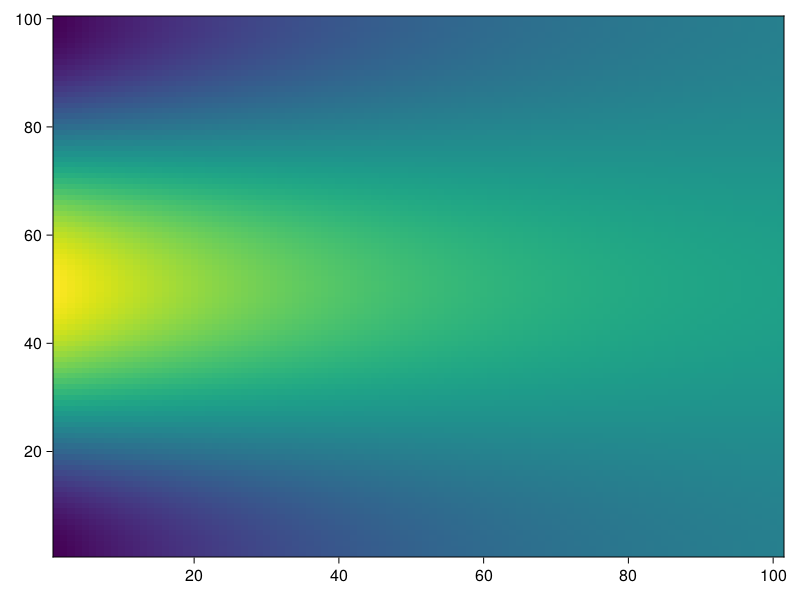

```@meta
CurrentModule = DiffusionSplineFE
```

# DiffusionSplineFE

Documentation for [DiffusionSplineFE](https://github.com/joristh/DiffusionSplineFE.jl).

We are looking at the 1D nonlinear diffusion equation on the interval domain $\Omega = [a, b]$

$$C(x)\frac{\partial T}{\partial t} = \frac{\partial}{\partial x} \left( D(x, T) \frac{\partial T}{\partial x}\right) + S(x,T), \quad x \in \Omega, T \in \mathbb{R}$$

with space-dependent capacity $C(x)$ and diffusion and source terms that can also depend on the variable $T$. Only the specific case of no heat flux across the domain boundaries is considered which corresponds to the Neumann boundary condition

$$\frac{\partial}{\partial x} T(a) = \frac{\partial}{\partial x} T(b) = 0.$$

## Usage

A SplineComplex object contains all necessary information about the spline spaces and collocations that are used. Let us create one with cubic splines from 11 knots on the domain $[-1, 1]$

```julia
using DiffusionSplineFE
using OrdinaryDiffEq

SC = SplineComplex((-1, 1), 11, 4)
```

For the problem, all three functions $C, D, S$ have to be defined. Let us assume constand capacity and diffusion and the absence of sources or sinks

```julia
C(x) = one(x)
D(x) = 0.002 #scalar diffusivity
S(x) = zero(x)
```

Initial spline coefficients are calculated from an initial codition

```julia
T_init(x) = cos(π*x)
u0 = initial_coefficients(SC, T_init)
```

Now we are ready to create the ODE problem that can be solved with any method in [OrdinaryDiffEq.jl](https://github.com/SciML/OrdinaryDiffEq.jl) like Crank-Nicolson in this example

```julia
tspan = (0, 100)
prob = DiffusionProblem(SC, C, D, S, u0, tspan)

sol = solve(prob, Trapezoid(autodiff=false), saveat=1)
```

Plotting recipes for [Makie.jl](https://github.com/MakieOrg/Makie.jl) can be used for visualization. Heatmaps or the custom `diffusionplot` for the full solution are available, as well as point based plotting for solutions at specific times.

```julia
using CairoMakie

fig, ax, lns = diffusionplot(SC, sol, 100)
lines!(ax, SC, sol[1], color=:red, linestyle=:dash, linewidth=5)
```


```julia
heatmap(SC, sol)
```




